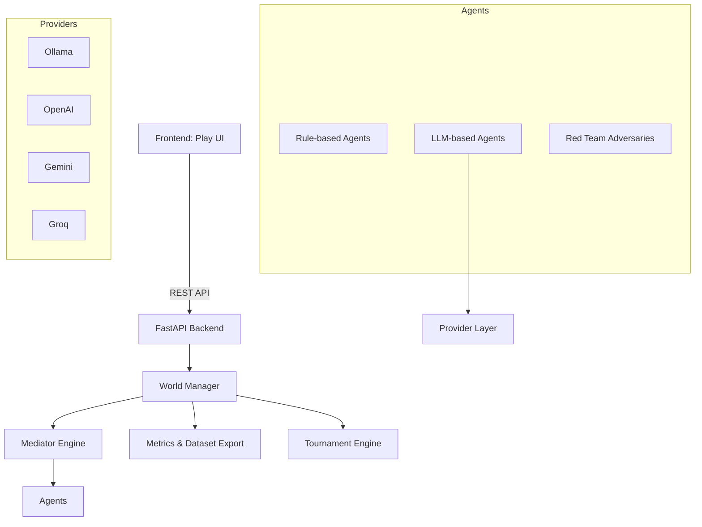

# Agent Sandbox

A professional research-grade environment for generating **Open-Source Multi-Agent Negotiation Datasets** locally.

## Overview
Agent Sandbox is a high-performance ecosystem designed for researchers to generate reproducible, high-fidelity datasets of LLM negotiation trajectories. By leveraging consumer-grade hardware and local inference (Ollama), it enables large-scale behavioral research without the costs of cloud-based APIs.

## Features
- **Model-Multiversal**: Pluggable provider system supporting Ollama (local), OpenAI, Gemini, and Groq.
- **Performance Arena**: Head-to-head benchmarking for comparing foundation model negotiation capabilities.
- **Scenario Architect**: Design and deploy custom negotiation environments via a dynamic UI.
- **Research-Grade Analytics**: Automated failure taxonomy, OpenTelemetry metrics, and one-click dataset exports.
- **Adversarial Testing**: Built-in Red Team agent to stress-test strategy robustness.
- **Hybrid Cloud Acceleration**: Cut 30-day simulations down to hours using remote GPU workers (Google Colab/Groq).

## System Architecture



## Research Benchmarks

The sandbox provides objective benchmarking for cross-model negotiation capability. Below is a snapshot from the latest model performance tests:

| Model | Success Rate (Agreement) | Avg Turns | Avg Latency |
| :--- | :--- | :--- | :--- |
| **Llama-3-8B (Ollama)** | 79.6% | 3.3 | N/A (Remote GPU) |
| **Mistral-7B-v0.3 (Ollama)** | 71.6% | 2.6 | N/A (Remote GPU) |

*(Note: Benchmarks vary based on strategy and risk parameters. Run the Intelligence Hub to generate your own datasets.)*

### 🔬 Key Results From The V1 Baseline

Our 24,000-simulation dataset revealed crucial insights about LLM negotiation behavior, proving the efficacy of the Sandbox as a rigorous testing environment:

**1. Simulation Outcomes**
- **Agreement (Success)**: ~26%
- **Failure**: ~31%
- **Timeout**: ~27%
- **Error**: ~16%

*Why is a 26% success rate good?* Most agent demos show 90%+ success, which usually means the task is too easy. A ~74% "problematic" outcome rate means the environment is hard enough to reliably reveal failures, deadlocks, and protocol constraints—making it an ideal testing ground for research systems.

**2. Negotiation Behavior & Friction**
The average negotiation length sits at **~5.9 turns**. This proves that agents do not simply concede on Turn 1. They actively debate, counter-offer, and frequently stop early due to genuine disagreements or deadlock conditions, consistent with our failure detector.

**3. Risk and Complexity Signals**
The average risk score across simulations is **~43 / 100**, suggesting moderate instability and highly interesting adversarial behaviors. This is exactly the kind of friction signal researchers need to analyze strategy robustness.

**4. Compute Latency**
Average decision latency is **~28 seconds**, indicating the heavy reasoning workload required by local foundations models to calculate strategy, parse context history, and output structured JSON decisions.

---

## Quick Start (One Command)

The fastest way to get started is using Docker Compose, which spins up the Backend and a local Ollama instance automatically:

```bash
docker-compose up -d
```
Then open `http://localhost:8000/play/` in your browser.

> [!NOTE]
> If running for the first time, you'll need to pull a model in the Ollama container:
> `docker exec -it agent-sandbox-ollama-1 ollama pull mistral`

---

## The Playground

Ready to see agents clash? Follow these steps for a 1-click Tournament:

1. Open the UI and navigate to the **Performance Arena**.
2. Select your models (e.g., `openai:gpt-4o` vs `ollama:mistral`).
3. Click **Start Battle**.
4. Watch the price trajectories and reasoning play out in real-time!

---

## Model Providers

Agent Sandbox is provider-agnostic. You can switch between:
- **Ollama** (Local/Default)
- **OpenAI** (GPT-4o, GPT-3.5)
- **Google Gemini** (1.5 Pro/Flash)
- **Groq** (Fast Llama/Mixtral)

See [Provider Guide](docs/providers.md) for setup instructions.

---

## Hardware Performance Guide

Optimized for consumer-grade researchers. You can comfortably run large-scale batches with Ollama (8GB+ VRAM recommended):

| Model Flavor | Benchmarking Stability | Recommended For |
| :--- | :--- | :--- |
| **Mistral-7B-Instruct-v0.3** | High | Large-scale datasets (q4) |
| **Llama-3-8B (Quantized)** | Medium | Rapid strategy testing |
| **Gemma-7B** | High | Reasoning depth analysis |
| **Qwen-2-7B** | High | Multi-vendor competition |

> [!TIP]
> **Reproducibility**: Use the `seed` parameter in `SimulationConfig` to ensure deterministic generation across researchers.

---

## Generating the Baseline Dataset

To generate the standard **Agent Sandbox V1 Benchmark** (24,000 simulations), use the provided research sweep script. This will sweep through 3 scenarios, 4 strategies, and 2 models with 1,000 runs each.

```bash
# Recommended: Run a quick test sweep first (5 runs per config)
python scripts/generate_dataset_v1.py --test

# Run the full 24,000 simulation sweep
python scripts/generate_dataset_v1.py --runs 1000
```

### 🚀 Scaling with Hybrid Cloud (Colab/Kaggle/Remote)
If your local hardware is struggling (e.g., estimating 30+ days), use the **Remote Worker** feature:
1. **Bridge**: Expose your local backend using **Cloudflare Tunnel** (`cloudflared tunnel --url http://localhost:8000`).
2. **Worker**: Run `scripts/kaggle_setup.py` on a Kaggle Notebook (Dual T4 GPUs) or `scripts/colab_setup.py` on Google Colab.
3. **Speed**: Each dual-T4 worker can process negotiations in bursts, allowing 20+ horizontal workers to clear the queue in hours instead of weeks.

See [Cloud Acceleration Guide](docs/cloud_acceleration.md) for step-by-step setup.

> [!IMPORTANT]
> **Performance**: A full sweep of 24,000 runs on a consumer-grade GPU (8GB VRAM) may take several days. Use the progress tracking feature (`GET /batch/{batch_id}/progress`) to monitor the status.

---
- `agents/`: Agent implementations and behaviors.
- `backend/`: FastAPI application core.
- `world/`: Simulation environment and mediation logic.
- `scenarios/`: Negotiation scenario definitions.
- `metrics/`: Failure detection and dataset export tools.
- `telemetry_module/`: OpenTelemetry tracking.
- `tournaments/`: Automated benchmarking and leaderboard logic.

---

## Documentation
- [Architecture Overview](docs/architecture.md)
- [Research Decisions](docs/memory_bank.md)
- [Model Provider Guide](docs/providers.md)

---

## Contributing
We welcome contributions! Please see [CONTRIBUTING.md](CONTRIBUTING.md) for guidelines.

---

## License
Released under the [MIT License](LICENSE).
